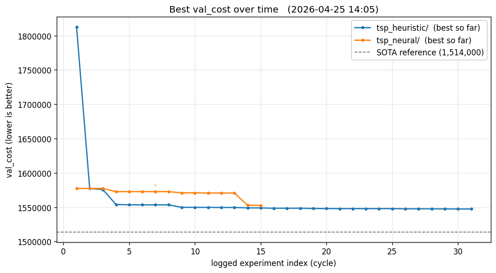

# autoresearch-tsp

Two autonomous LLM research loops attacking the
[Kaggle Traveling Santa 2018 Prime Paths](https://www.kaggle.com/competitions/traveling-santa-2018-prime-paths/overview)
TSP (197,769 cities, 1.1× penalty on every 10th step from a non-prime
origin). Same metric, same 5-min budget per cycle, same keep-or-revert
mechanic. Different *levers* the agent can pull. See
[Provenance](#provenance) for inspiration.

## The two projects

|                  | [`tsp_heuristic/`](tsp_heuristic/)        | [`tsp_neural/`](tsp_neural/)                  |
|------------------|------------------------------------------|------------------------------------------------|
| **Approach**     | classical heuristic search               | neural-guided local search                     |
| **Lever**        | algorithm design                         | model design + integration                     |
| **Trains a model?** | **no** — pure numpy/numba/scipy       | **yes** — small PyTorch model per cycle        |
| **What's optimised** | a permutation of 197,769 ints (the tour) | a tour, *plus* the move-scorer that helps build it |
| **Deps**         | numpy, pandas, sympy, scipy, numba       | + `torch`                                      |
| **Pipeline shape** | construction → local search → perturbation → polish (agent mutates every cycle) | construction → local search guided by a learned model (agent mutates every cycle) |
| **Risk**         | low; classical literature is deep        | high; learned/classical glue is fiddly         |

Both share `prepare.py` (the metric is bit-identical) and the same
harness shape: agent edits one file (`solve.py`), runs under a
fixed 5-min budget, scores against `val_cost`, keeps or reverts,
appends to `results.tsv`, repeats.

Each subdir is self-contained. See its `README.md` for setup, its
`AGENTS.md` for the tooling inventory, and its `program.md` for the
loop's operating rules.

## Layout

```
tsp_heuristic/    classical loop
tsp_neural/       neural-guided loop
autoresearch/     vendored upstream (karpathy's repo, reference only)
AGENTS.md         agent guidance for the outer repo
```

## Kick off the agents

Each loop runs as its **own Claude Code session** inside its subdir.
Both share branch `main`; each agent only ever edits files inside
its own subdir, and `just revert` uses `git revert HEAD --no-edit`
so a discard from one loop never wipes the other's commits.

### One-time setup

```bash
# Unzip the Kaggle archive into tsp_heuristic/data/ so cities.csv exists.
unzip traveling-santa-2018-prime-paths.zip -d tsp_heuristic/data/

# Install deps for each loop (tsp_neural pulls ~2 GB of PyTorch first time).
(cd tsp_heuristic && uv sync)
(cd tsp_neural    && uv sync)
```

### Launch each loop

Open *two* terminals. In each, `cd` into the subdir and start a fresh
Claude Code session (`claude`). Paste this prompt verbatim:

> *"Read `AGENTS.md` and `program.md`. Verify smoke test (`just data` then `just run`), then start the experiment loop on `main` per `program.md`. Iterate until I interrupt — never stop on your own."*

(For a fresh `tsp_neural/` setup with no prior checkpoint, additionally
note: *"the first ~3 cycles must introduce learning per `program.md`
(T1 harvest → M1 train → I1 integrate)"*. Skip if a checkpoint already
exists in `checkpoints/`.)

### Monitor progress

```bash
git log --oneline -10                # interleaved exp: / meta: commits
(cd tsp_heuristic && just status)    # per-loop head + last result + recap-pending
(cd tsp_neural    && just status)
xdg-open progress.png                # or any image viewer
```

The Status table + `progress.png` are refreshed periodically by an
out-of-band cron driver (separate from either loop's session).

### Stop a loop

- Interrupt the relevant Claude Code session (Ctrl-C or `/exit`).
- The other loop is unaffected (separate session, separate
  `solve.py`, no shared `HEAD` operations).

## Status

*As of 2026-04-25 19:11 EDT. SOTA = 1,514,000 (Santa 2018 top
public-LB). `val_cost` is the official Santa 2018 cost (lower is
better). `% SOTA` = `100 − gap`, where `gap = (val_cost − SOTA) / SOTA`.*

| Loop | % SOTA | Best `val_cost` | Cycles |
|---|---|---|---|
| `tsp_heuristic/` | 97.80% | 1,547,351 | 64 |
| `tsp_neural/`    | 97.54% | 1,551,306 | 46 |



Run-by-run history lives in each subproject's `recaps/` (committed)
and `results.tsv` (gitignored, local-only).

## Provenance

- **Inspiration & template**: [karpathy/autoresearch](https://github.com/karpathy/autoresearch).
- **Task**: [Kaggle Traveling Santa 2018 Prime Paths](https://www.kaggle.com/competitions/traveling-santa-2018-prime-paths/).
- **Inspired by this video**: [marimo: autoresearch on the Santa 2018 TSP](https://www.youtube.com/watch?v=bMoNOb0iXpA).

## Forking on different hardware

This run targets **one specific host**: an RTX 4070 (16 GB VRAM) +
ample CPU/RAM. The 5-minute per-cycle budget and the various tuning
defaults (`K_NEIGHBORS`, model param caps, batch sizes) are sized for
that machine. Both `program.md` files reflect that target as written.

If you fork on different hardware, treat the program.md hardware lines
as your customisation point and adjust derived knobs accordingly:

- **`tsp_heuristic/`** is CPU-bound (numpy / scipy / numba — no GPU).
  Relevant specs are core count and RAM. A 4-core laptop will
  struggle with the 5-min budget — consider tightening `K_NEIGHBORS`
  or disabling expensive Or-opt sweeps.
- **`tsp_neural/`** uses the GPU for PyTorch model training:
  - **Smaller GPU (≤8 GB)** — cap params at ~250K, halve batch size,
    consider fp16 / bf16 inference (E-class engineering ideas).
  - **Larger GPU (24 GB+)** — train bigger MLPs / shallow
    transformers, but inner-loop inference latency stays the
    bottleneck — bigger models need to earn their cost vs the
    distilled-numba baseline.
  - **CPU-only / MPS** — latency budget will tighten dramatically.
    May not be worth pursuing the neural differentiator on this
    hardware vs. just running `tsp_heuristic/`.

Land hardware-target changes (and any derived knob tweaks) in a
`meta:` commit so the trail is auditable.

## Methodology caveat — we started "cheating"

Around **heuristic-loop cycle 38** we began invoking `paper-researcher`
with queries scoped to **Santa 2018-specific writeups** —
i.e., reading other people's solutions to this exact problem rather
than only general TSP / heuristic-search / learned-LKH literature.
(The first such invocation actually fell back to generic GLS / LKH /
Blazinskas literature per a user instruction, but the *intent* and
the era directive crossed the line.)

This contaminates the "can the LLM agent independently solve this
from first principles + generic literature" question. Any subsequent
`val_cost` lift may have been seeded by an idea the agent recognized
from a competition writeup rather than derived autonomously.

We're keeping the door open going forward: experiments and
harness-evaluation reports should distinguish the un-contaminated
subset (pre-domain-research, plus runs using only `classical` /
`hybrid` / `modern-learned` era queries) from the contaminated
subset (post-domain-research, runs using `domain-specific` era
queries). Note this explicitly in any future write-up.

## License

MIT.
